# ASSVA — Solar Racing Driver Assist

Real-time driver assistance system for a solar racing car. Streams video from a Raspberry Pi camera, runs TFLite object detection (cones & potholes), and displays detection overlays, telemetry, and GPS on an Android tablet.

## Architecture

```mermaid
flowchart TB
    subgraph PI["🟢 Raspberry Pi"]
        direction LR
        CAM["📷 Camera"] --> OCV["OpenCV"] --> TFL["TFLite\nInference"] --> SRV["aiohttp\nServer"]
    end

    SRV -- "/stream · MJPEG" --> APP
    SRV -- "/detections · JSON" --> APP
    APP -- "/set_model" --> SRV

    subgraph APP["📱 Android App · React Native"]
        direction LR
        VID["MjpegView"] ~~~ DET["DetectionOverlay"] ~~~ MAP["MapDashboard"]
        CTL["ControlPanel"] ~~~ TEL["TelemetryDashboard"] ~~~ SOL["SolarOverlay"]
    end
```



## Quick Start

### Pi Server

```bash
cd pi

# Create venv and install dependencies
python3 -m venv venv
source venv/bin/activate
pip install aiohttp opencv-python-headless numpy ai-edge-litert

# Place models
mkdir -p models
# Copy cone_detect.tflite and pothole_detect.tflite into models/

# Run server
python3 server.py
```

The server runs on `http://0.0.0.0:8080` with these endpoints:

| Endpoint | Method | Description |
|---|---|---|
| `/stream` | GET | MJPEG video stream |
| `/frame` | GET | Single JPEG snapshot |
| `/detections` | GET | Latest detection results (JSON) |
| `/set_model` | POST | Switch model: `{"model": "cone\|pothole\|off"}` |
| `/status` | GET | Health check + model status |
| `/debug` | GET | Raw model output for debugging |

### Android App

```bash
# Install dependencies
npm install

# Build and run on connected Android device
npx expo run:android
```

> **Note:** The app connects to the Pi at `10.165.71.121:8080`. Update `PI_URL` in `src/App.tsx` and `src/services/InferenceClient.ts` if your Pi has a different IP.

## Project Structure

```
├── pi/                          # Raspberry Pi server
│   ├── server.py                # MJPEG + TFLite inference server
│   └── models/                  # TFLite model files
│       ├── cone_detect.tflite
│       └── pothole_detect.tflite
├── src/
│   ├── App.tsx                  # Main app — video + overlays + dashboard
│   ├── components/
│   │   ├── MjpegView.tsx        # WebView-based MJPEG viewer
│   │   ├── DetectionOverlay.tsx  # SVG bounding boxes + collision warning
│   │   ├── ControlPanel.tsx     # Cone/Pothole/Off model toggle
│   │   ├── TelemetryDashboard.tsx # Speed, battery, power, range
│   │   └── MapDashboard.tsx     # GPS map with path history
│   ├── services/
│   │   └── InferenceClient.ts   # Polls /detections, sends /set_model
│   └── store/
│       └── useAppStore.ts       # Zustand state (detections, telemetry, etc)
├── __tests__/                   # Integration tests
│   ├── controls.integration.test.ts
│   ├── telemetry.integration.test.ts
│   ├── maps.integration.test.ts
│   └── webrtc.integration.test.ts  # (inference tests)
└── package.json
```

## Features

- **MJPEG Video Stream** — Low-latency camera feed via HTTP
- **TFLite Inference** — Cone and pothole detection on the Pi
- **Detection Overlay** — Bounding boxes drawn over the video in real-time
- **Collision Warning** — Flashing ⚠ CONE AHEAD when a cone is in the danger zone for 3+ consecutive frames
- **Model Switching** — Toggle between cone, pothole, or off from the app
- **Telemetry** — Speed, battery, power consumption, range display
- **GPS Map** — Live position with path history

## Models

| Model | Input Size | Format | Type |
|---|---|---|---|
| Cone Detection | 320×320 | SSD `[x1,y1,x2,y2,conf,class]` | uint8 quantized |
| Pothole Detection | 256×256 | SSD `[x1,y1,x2,y2,conf,class]` | float32 |

## Testing

```bash
npm test
```

## Network Setup

The Pi connects to the Android phone's Wi-Fi hotspot via Ethernet. The phone runs the app and communicates with the Pi over standard HTTP.

```mermaid
flowchart TD
    HOTSPOT["📶 Phone Wi-Fi Hotspot\n10.165.71.x"] -->|Ethernet| PI["🟢 Raspberry Pi\n10.165.71.121"]
    HOTSPOT -->|Localhost| APP["📱 Phone App\nDisplay + Controls"]
    PI <-->|HTTP| APP
```


